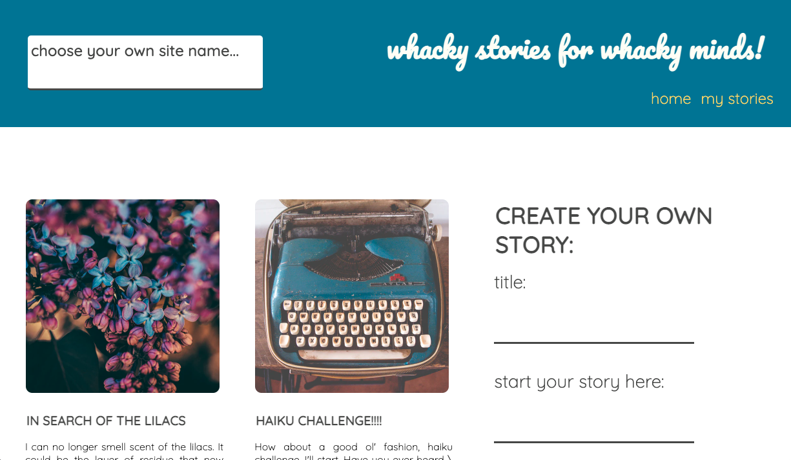

# StoryCreator

## About

StoryCreator is an interactive app that allows users to read, create, and contribute to user-made stories.

Have an idea for a story but don't know where to go with it? Submit the beginning of the story with a title and image for all other users to peruse. If another user likes this story, they can submit a contribution for the creator to review. Users have the ability to upvote pending contributions they really like. If the creator likes a contribution, they can append it to the story!

Once the story creator is satisfied with their collectively built story, they can submit it. Users will still be able to read and enjoy the story but they will no longer be able to add contirbutions.

Join in on the fun!

## Screenshots

The user login page:

The homepage shows a gallery of all available stories to read and includes a prominent form to submit your own story.

Users can fill in a form that includes a story title, the beginning text, and a url that links to a picture of their choosing.

The newly contributed story appears in the user's personal library (accessed via my stories link on nav bar)

Other users can make suggested contributions to any story with an "in progress" status. The creator of the story can choose whether they would like to append the text or reject it.

An example of the above contirbution being approved and added to the story:

The form for adding a contribution to an in progress story, along with all other pending contirbutions, seen from the perspective of a user who did not start the story.

Completed stories are marked with a "completed" status tag. They can be read but cannot be added to.

# LHL Node Skeleton

## Project Setup

The following steps are only for _one_ of the group members to perform.

1. Create your own copy of this repo using the `Use This Template` button, ideally using the name of your project. The repo should be marked Public
2. Verify that the skeleton code now shows up in your repo on GitHub, you should be automatically redirected
3. Clone your copy of the repo to your dev machine
4. Add your team members as collaborators to the project so that they can push to this repo
5. Let your team members know the repo URL so that they use the same repo (they should _not_ create a copy/fork of this repo since that will add additional workflow complexity to the project)

## Getting Started

1. Create the `.env` by using `.env.example` as a reference: `cp .env.example .env`
2. Update the .env file with your correct local information

- username: `labber`
- password: `labber`
- database: `midterm`

3. Install dependencies: `npm i`
4. Fix to binaries for sass: `npm rebuild node-sass`
5. Reset database: `npm run db:reset`

- Check the db folder to see what gets created and seeded in the SDB

7. Run the server: `npm run local`

- Note: nodemon is used, so you should not have to restart your server

8. Visit `http://localhost:8080/`

## Warnings & Tips

- Do not edit the `layout.css` file directly, it is auto-generated by `layout.scss`
- Split routes into their own resource-based file names, as demonstrated with `users.js` and `widgets.js`
- Split database schema (table definitions) and seeds (inserts) into separate files, one per table. See `db` folder for pre-populated examples.
- Use the `npm run db:reset` command each time there is a change to the database schema or seeds.
  - It runs through each of the files, in order, and executes them against the database.
  - Note: you will lose all newly created (test) data each time this is run, since the schema files will tend to `DROP` the tables and recreate them.

## Dependencies

- Node 10.x or above
- NPM 5.x or above
- PG 6.x

## ERD

